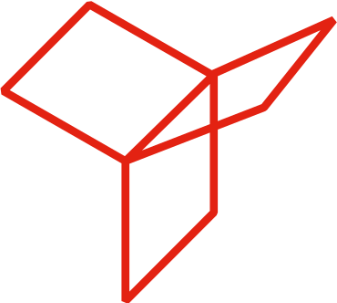

# Experience

<table align=center class="work" style="background-color: rgb(0, 0, 0)">
  <tbody>
    <tr>
      <!-- <td></td> -->
      <td>
        <h2>Research Intern, Qualcomm (Feb'22 - present)</h2>
        <h3>Machine Learning Researcher</h3>
        
        <ul>
          <li> Goal: Research on Machine Learning techniques and algorithmsfor the application/usecase of 5G and XR (eXtended Reality) </li>
          <li> Internship part of the M2 (master's final year) thesis</li>
            
        </ul>
      </td>
    </tr>
    <tr>
      <!-- <td></td> -->
      <td>
        <h2>Open-Source Researcher, The Sound of AI (Feb'21 - Nov'21)</h2>
        <h3>NLP Researcher</h3>
        
        <ul>
          <li> Goal: Part of an open-source research community for the development of a voice-controlled neural network-based synthesizer for generating musical sounds </li>
          <li> Named-entity Recognition (NER) of musical instruments and qualities using spaCy</li>
          <li>Currently underway writing a research paper for a journal</li>  
        </ul>
      </td>
    </tr>
    <tr>
      <!-- <td></td> -->
      <td>
        <h2>ML Technical Content Writer, YData (Aug'21 - present)</h2>
        <!-- <h3>NLP Researcher</h3> -->
        
        <ul>
          <li>Goal: Perform a study on GANs and research on artificial data generation </li>
          <li>Contributed to YData's <a href="https://github.com/ydataai/ydata-synthetic">repository</a> for small bug fixes</li>
          <li>Published 2 articles regarding tabular and timeseries synthetic data generation on Towards Data Science</li>
            
        </ul>
      </td>
    </tr>
    <tr>
      <!-- <td></td> -->
      <td>
         
        <h2>Research Intern, TIMA (Feb'20 - June'20)</h2>
        <h3>Study of CHISEL Language for FPGAs</h3>
        
        <ul>
          <li>Literature Review and a detailed study about CHISEL language and multiplication based convolution</li>
          <li>Proposed a modified approach for convolution incorporating parallelism</li>  
        </ul>
      </td>
    </tr>
    <tr>
      <!-- <td></td> -->
      <td>
         
        <h2>Researcher, Shiv Nadar University (Sep'18 - Apr'19)</h2>
        <h3>MIMO Communication System based Researcher</h3>
        
        <ul>
          <li> Performed a study of MIMO communication system; Implemented a basic model in MATLAB; made use of various signal processing techniques like Multi-path fading, block coding</li>
          <li>Implemented Transmitter as well as Receiver, both incorporating various blocks like QPSK Modulator/ Demodulator, Filter, Ramanujan Phasor Estimation to name a few</li>
          <li>Translated the model in Simulink and interfaced with USRP board (SDR, Software-Defined Radio based)</li>
          <li>Studied about possible data encoding techniques like Arithmetic Coding, Huffman Coding; Antenna Switching and Spatial Modulation</li>
          <li>Conducted a tutorial session on behalf of Prof. Vijay K. Chakka for introducing MIMO to a junior undergrad batch</li>  
        </ul>
      </td>
    </tr>
    <tr>
      <!-- <td></td> -->
      <td>
         
        <h2>Research Intern, LIRMM (May'18 - July'18)</h2>
        <h3>Hardware Trojan based Software Developer</h3>
        
        <ul>
          <li>Learnt about Hardware Trojan (HWT); Reported extensive literature review; Implemented a metric for finding out number of HWT trigger attacks in order of millions using C++ and MATLAB</li>
          <li>Optimized trigger calculation and reduced computation time in the order of days to minutes</li>
          <li>Met Specific deadlines for finalizing two scientific papers; <i>"demonstrated to have above-average software engineering skills, rigor, scientific curiosity, perseverance and demonstrated important human relation skills",</i> as mentioned by the supervisor</li>
          <li>Contributed to 2 research papers for publishing in an international conference</li>  
        </ul>
      </td>
    </tr>
    <tr>
      <!-- <td></td> -->
      <td>
         
        <h2>Research Intern, IIT Jodhpur (May'17 – July'17)</h2>
        <h3>GNSS Receiver Developer</h3>
        
        <ul>
          <li>Goal: Understand the basics of a GPS system and implement a smaller version of signal phase and frequency locker; End of 2nd year bachelor’s internship</li>
          <li>Reported a background study on GNSS (Global Navigation Satellite System) technology</li>
          <li>Implemented part of GPS receiver in MATLAB & improved an algorithm for error calculation.</li>  
        </ul>
      </td>
    </tr>
    <tr>
      <!-- <td></td> -->
      <td>
         
        <h2>Summer Trainee, DRDO (May'16 – July'16)</h2>
        <h3>Radiation based Hardware-Software Developer</h3>
        
        <ul>
          <li>Goal: Learn the basics and programming of a microcontroller, Object Oriented Programming for Java and Android; Industrial summer trainee at the end of 1st year of bachelor’s</li>
          <li>Designed and implemented an Android app; Established a wired connection between the app and microcontroller for data transfer; Textual and graphical display of data on the app</li> 
        </ul>
      </td>
    </tr>
  </tbody>
</table>

  

[Return to main page](./index.html)