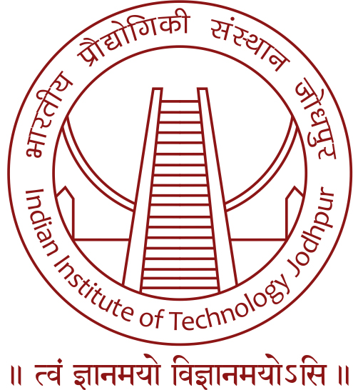

# Experience

<table>
  <tbody>
    <tr>
      <td></td>
      <td>
        <h2>Open-Source Researcher, The Sound of AI (Feb'21 - present)</h2>
        <h3>NLP Researcher</h3>
        • Part of an open-source research community for the development/research of a voice controlled neural synthesizer (AI based) for generating musical sounds  
        • Working in the dataset team; current responsibilities - NLP based data augmentation of text; Named-entity Recognition (NER) of musical instruments using spaCy 
      </td>
    </tr>
    <tr>
      <td></td>
      <td>
        <h2>Research Intern, TIMA (Feb'20 - June'20)</h2>
        <h3>Study of CHISEL Language for FPGAs</h3>
        • Literature Review and a detailed study about CHISEL language and multiplication based convolution 
        • Proposed a modified approach for convolution incorporating parallelism 
      </td>
    </tr>
    <tr>
      <td></td>
      <td>
        <h2>Researcher, Shiv Nadar Unniveristy (Sep'18 - Apr'19)</h2>
        <h3>MIMO Communication System based Researcher</h3>
        • Part of an open-source research community for the development/research of a voice controlled neural synthesizer (AI based) for generating musical sounds  
        • Working in the dataset team; current responsibilities - NLP based data augmentation of text; Named-entity Recognition (NER) of musical instruments using spaCy 
      </td>
    </tr>
    <tr>
      <td></td>
      <td>
        <h2>Research Intern, LIRMM (May'18 - July'18)</h2>
        <h3>Hardware Trojan based Software Developer</h3>
        •	Learnt about Hardware Trojan (HWT); Reported extensive literature review; Implemented a metric for finding out number of HWT trigger attacks in order of millions using C++ and MATLAB 
        •	Optimized trigger calculation and reduced computation time in the order of days to minutes 
        •	Met Specific deadlines for finalizing two scientific papers; <i>"demonstrated to have above-average software engineering skills, rigor, scientific curiosity, perseverance and demonstrated important human relation skills",</i> as mentioned by the supervisor  
        • Contributed to 2 research papers for publishing in an international conference
      </td>
    </tr>
    <tr>
      <td></td>
      <td>
        <h2>Research Intern, IIT Jodhpur (May'17 – July'17)</h2>
        <h3>GNSS Receiver Developer</h3>
        •	Reported a background study on GNSS (Global Navigation Satellite System) technology  
        • Implemented part of GPS receiver in MATLAB & improved an algorithm for error calculation.
      </td>
    </tr>
    <tr>
      <td></td>
      <td>
        <h2>Summer Trainee, DRDO (May'16 – July'16)</h2>
        <h3>Radiation based Hardware-Software Developer</h3>
        • Learnt the basics of a microcontroller; Learnt C for hardware, and Java for Android 
        • Designed and implemented an Android app; Established a wired connection between the app and microcontroller for data transfer; textual and graphical display of data on the app
      </td>
    </tr>
  </tbody>
</table>

  

# Publications

<i>“First Steps Towards Runtime Hardware Trojan Detection in Microprocessors through Software Diversity”</i>

<i>“Towards Common Reference Methods to Evaluate Detection Techniques for Hardware Trojans in Microprocessors”</i>
<ul>
    <li> Two joint research papers expected to be published at a conference </li>
    <li> Result of work done in internship at LIRMM under Prof. Giorgio Di Natale </li>
    <li><a href="https://drive.google.com/file/d/1AGi2RDS6ohoc4FFPb4kj4tXz4aAx9BZ-/view?usp=sharing">Paper snippet</a></li>
</ul>

  

[Return to main page](./index.md)