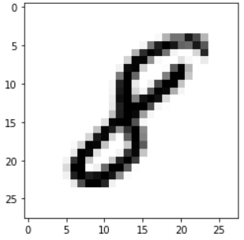

# Projects

## Machine Learning / Data Science based projects

Music Processing and Genre Classifier using AI
* Studied and implemented basic audio data analysis like waveform, spectrogram, Extracting MFCCs

* Implemented a music genre classifier based on dataset of GTZAN; Built dataset based on extracted MFCCs
* Experimented with Basic Neural Network, CNN and RNN (LSTM)
* Main libraries: TensorFlow/Keras, Librosa, Sklearn and SpotiPy
* [GitHub](https://github.com/archity/music-processing) repository

---

Understanding COVID-19 Trends on Twitter
* Current personal project underway

* Implemented command-line bsaed scrapper for obtainng the links of tweets for specific range of months.
* Currently in the process of applying various analysis techniques, including NLTK.
* [GitHub](https://github.com/archity/covid-twitter-trends) Repository

---

Digit Recognition using Neural Network
* Made an image classifier for recognizing handwritten digits

* Applied various CNN architectures and did several experiments
* Made use of Keras and scikit-learn
* [GitHub](https://github.com/archity/mnist-image-classifier) Repository

---

Fairness in Classification on COMPAS Dataset

* Performed analysis of bias in arrests
* Applied several classifiers to learn about trends in recidivism

---

Analysis of Mobile App Store Applications

* Performed analysis of 24k+ mobile apps
* Made a web scrapper for Google Play Store using Python

---

Stock Price Prediction using Machine Learning

* Performed basic data analysis

* Applied several algorithms to predict stock price
* Used Linear Regression (MATLAB code), SVM (Python) and Neural Networks (MATLAB toolbox), along with PCA for feature reduction
* [GitHub](https://github.com/archity/AML-Project) Repository

 

---

 

## Embedded Systems / Electronics projects

Hardware Implementation of MIMO
* Bachelor’s major project
* MIMO model studied and implemented in MATLAB
* Model made in Simulink and interfaced with USRP (SDR based) board

---

FPGA Pong Game
* Implemented on an FPGA using Verilog
* Designed walls, bricks and a moving ball and paddle
* Secured ‘A’ grade in the same course
* [GitHub](https://github.com/archity/Breakout-Game-Verilog) Repository

---

Gyro controlled Vehicle
* Made a remote-controlled vehicle using gyroscope sensor
* Implemented on STM32 microcontroller using MPU6050 sensor
* ZigBee used for communication between vehicle and remote (MPU sensor)

 

---

 

## Other Projects

Mobile App based password generator
* Android app that generates password specific to device
* Developed a cryptographic algorithm for generation

  

[Return to main page](./index.html)