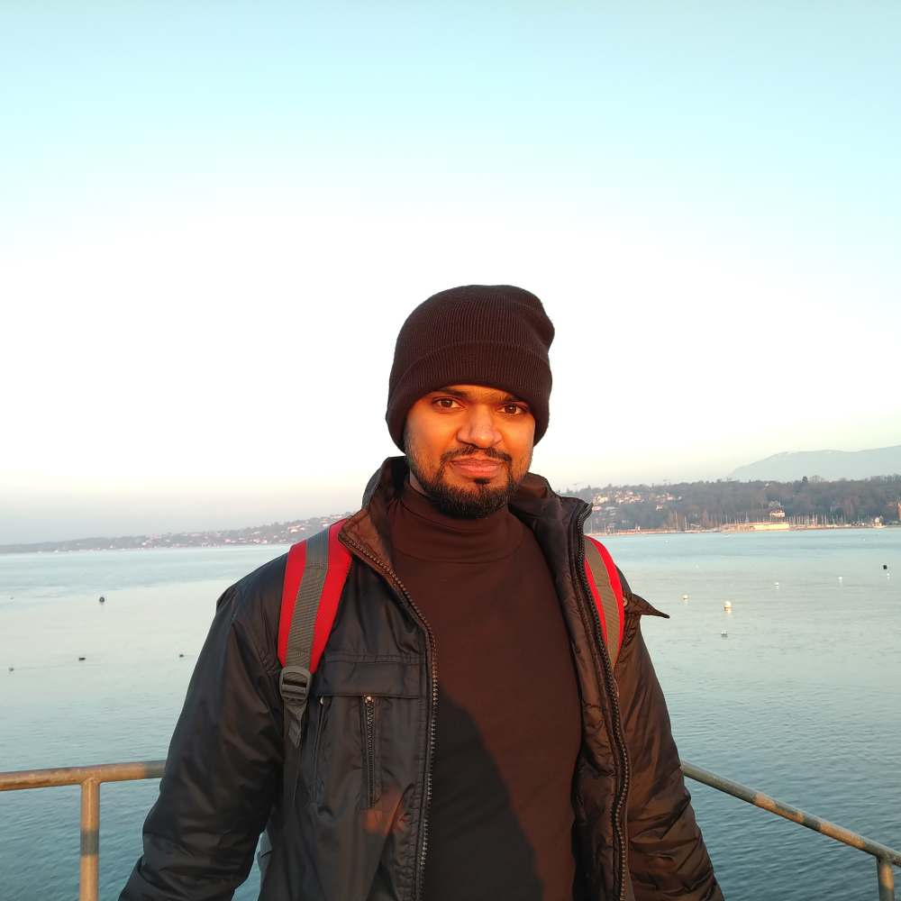

Hello World!

I'm a master's student currently pursing my MSc. in Computer Science from Université Grenoble Alpes in Grenoble, France.

My main fields of interests broadly are Signal Processing, Embededd Systems and AI. Specific fields of interests are Natural Language Processing (NLP), and recently I'm also trying to learn about Music Information Retrieval (MIR), which had caught my interest.

In my free time, I enjoy drawing/sketching. Reading is another hobby of mine since a long time. Here are the links to some of my [artworks](./drawings.md), and my current [reading](./reads.md) list.

   

# [Experience](./Experience.md)

# [Research Projects](./Projects.md)
     
 

