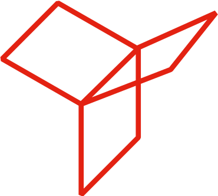
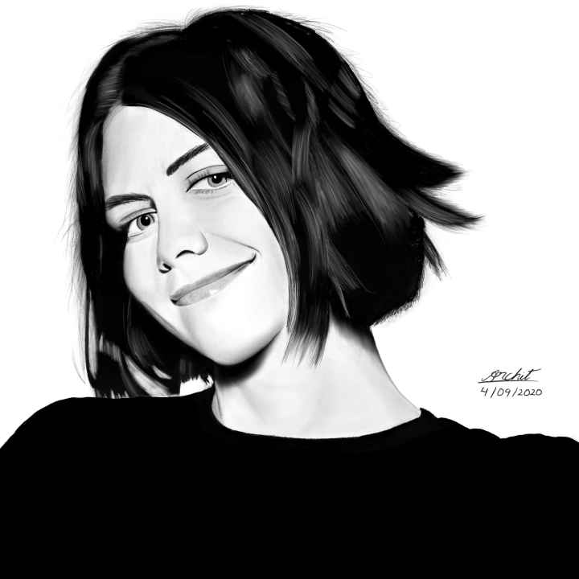
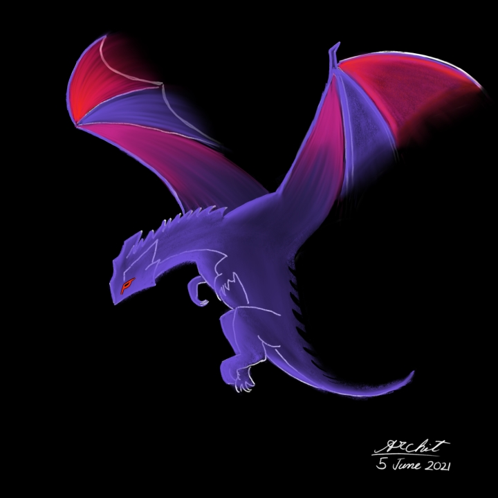
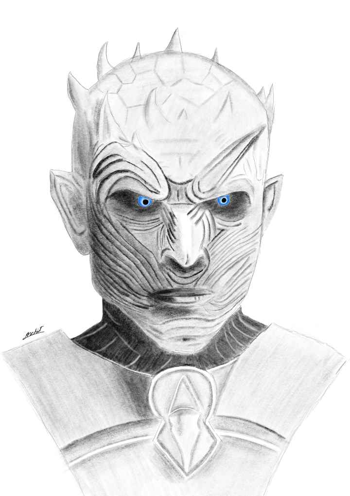

Hello World!

I'm a master's student currently pursing my MSc. in Computer Science from Université Grenoble Alpes in Grenoble, France.

My main fields of interests broadly are Signal Processing, Embededd Systems and AI. Specific fields of interests are Natural Language Processing (NLP), and audio-based AI, or Music Information Retrieval (MIR).

In my free time, I enjoy drawing/sketching. Reading is another hobby of mine since a long time. Here are some of my [artworks](#artworks), and my current [reading](./reads.html) list.

Organisation of rest of this website as follows:

* [Projects](#projects)
* [Work/Research Experience](#work-experience)
* [Education](#education)
* [Publications](#publications)
* [Artworks](#artworks)

   

# Projects

<table align=center class="project">
  <tbody>
    <tr>
      <!-- Cell 1 -->
      <td style="text-align: center; vertical-align: middle;"> 
      <h3>Music Processing and Genre Classifier using DSP and Deep Learning</h3> 
      
      <ul>
        <li> Goal: Understand audio as input data and identify its characteristics; Build a model to distinguish different genres of music using Digital Signal Processing and RNN/LSTM architectures </li>
        <li> Performed basic audio data analysis like waveform, spectrogram, Extracting MFCCs </li>
        <li> Implemented a music genre classifier based on dataset of GTZAN; Built dataset based on extracted MFCCs from audio files; Experimented with Basic Neural Network, CNN and RNN (LSTM) </li>
        <li> Currently in process of predicting genre from Spotify songs </li>
        <li> <a href="https://github.com/archity/music-processing">GitHub repository</a> </li>
      </ul>
       </td>
      <!-- Cell 2 -->
      <td style="text-align: center; vertical-align: middle;"> 
      <h3>Understanding COVID-19 Trends on Twitter using NLP</h3> 
      
      <ul>
        <li> Goal: Understand the trends and the changing trends on Twitter throughout the year 2020 related to the COVID-19 pandemic; Understand, correlate and verify the findings with respect to the real-world news/data </li>
        <li> Implemented a shell script for creating a command-line based scrapper for several 1000s of tweets from Twitter </li>
        <li> Cleaned extracted tweets; Applied various analysis techniques like wordclouds, trend of a given word w.r.t. month; TextBlob and logistic regression for sentiment analysis </li>
        <li> <a href="https://github.com/archity/covid-twitter-trends">GitHub repository</a> </li>
      </ul>
       </td>
    </tr>
    <tr>
      <!-- Cell 3 -->
      <td style="text-align: center; vertical-align: middle;"> 
      <h3>Document Scanner and Summarizer using OpenCV and PyTextRank</h3>  
      
      <ul>
        <li> Goal: Create an image scanner and summarizer; Understand the pipeline behind mainstream doc scanner apps and apply Computer Vision and NLP to build a doc scanning prototype </li>
        <li> Image processing pipeline utilizing OpenCV constructed; blurring, edge detection, warping, thresholding </li>
        <li> Text summarization to generate a summary and key phrases from the scanned text </li>
        <li> <a href="https://github.com/archity/doc-scanner">GitHub repository</a> </li>
      </ul>
       </td>
      <!-- Cell 4 -->
      <td style="text-align: center; vertical-align: middle;"> 
      <h3>3D Graphics based Medieval Scene using OpenGL</h3>
       
      
      <ul>
        <li> Goal: Create a 3D scene with medieval period as a theme, for the course 3D Graphics </li>
        <li> Graphics processing pipeline involving modelling, rendering and animation implemented </li>
        <li> Game-like interface created with 1st person POV </li>
        <li> <a href="https://github.com/archity/3d-graphics-project">GitHub repository</a> </li>
      </ul>
       </td>
    </tr> 
  </tbody>
</table>

   

# Work Experience

<table align=center class="work">
  <tbody>
    <tr>
      <!-- <td></td> -->
      <td>
        <h2>ML Technical Content Writer, YData (Aug'21 - present)</h2>
        <!-- <h3>NLP Researcher</h3> -->
        
        <ul>
          <li>Goal: Perform a study on GANs and research on artificial data generation </li>
          <li>Contributed to YData's <a href="https://github.com/ydataai/ydata-synthetic">repository</a> for small bug fixes</li>
          <li>Published 2 articles regarding tabular and timeseries synthetic data generation on Towards Data Science</li>
            
        </ul>
      </td>
    </tr>
    <tr>
      <!-- <td></td> -->
      <td>
        <h2>Open-Source Researcher, The Sound of AI (Feb'21 - present)</h2>
        <h3>NLP Researcher</h3>
        
        <ul>
          <li> Goal: Part of an open-source research community for the development of a voice-controlled neural network-based synthesizer for generating musical sounds </li>
          <li> Named-entity Recognition (NER) of musical instruments and qualities using spaCy</li>
          <li>Currently underway writing a research paper for a journal</li>  
        </ul>
      </td>
    </tr>
  </tbody>
</table>

 

More on experience [here](./Experience.html)

   

# Education

## MSc. Computer Science (MoSIG)

* Université Grenoble Alpes (UGA) - ENSIMAG  
Grenoble, France
* Specialization: Human and Digital World Interaction (HDWI)
* Grad year: 2022
* Grade point: 12/20
* Courses taken in HDWI:
  * Robotics
  * Human in the Loop
  * Augmented and Virtual Reality
  * Computer Vision
  * Natural Language Processing
  * Machine Learning for Multimodal Data

 

## B.Tech. Electronics & Communication

* Shiv Nadar University (SNU)  
Greater Noida, India
* Grad year: 2019
* Grade point: 7.85/10
* Thesis: Background Study and Hardware/Software Implementation of MIMO

   

# Publications

## Research Paper

<ul>
  <li><i>“First Steps Towards Runtime Hardware Trojan Detection in Microprocessors through Software Diversity”</i></li>

  <li><i>“Towards Common Reference Methods to Evaluate Detection Techniques for Hardware Trojans in Microprocessors”</i></li>
  <ul>
      <li> Two joint research papers expected to be published at a conference </li>
      <li> Result of work done in internship at LIRMM under Prof. Giorgio Di Natale </li>
      <li><a href="https://drive.google.com/file/d/1AGi2RDS6ohoc4FFPb4kj4tXz4aAx9BZ-/view?usp=sharing">Paper snippet</a></li>
  </ul>
</ul>

## Medium Articles
### (Towards Data Science)

<ul>
<li><a href="https://towardsdatascience.com/generating-expanding-your-datasets-with-synthetic-data-4e27716be218"><i>"Generating/Expanding your datasets with synthetic data"</i></a></li>
<li><a href="https://towardsdatascience.com/modeling-and-generating-time-series-data-using-timegan-29c00804f54d"><i>"Modeling and Generating Time-Series Data using TimeGAN"</i></a></li>
<ul>
    <li> Both articles featured as a   post by TDS' official LinkedIn page</li>
    <li> <a href="https://www.linkedin.com/posts/towards-data-science_generatingexpanding-your-datasets-with-synthetic-activity-6830942570487578624-cbWN">LinkedIn post 1 </a> </li>
    <li> <a href="https://www.linkedin.com/posts/towards-data-science_modeling-and-generating-time-series-data-activity-6842039187789754368-rUPi">LinkedIn post 2 </a> </li>
</ul>
</ul>

   

# Artworks

Some of my favourite drawings. More can be found on my [Instagram](https://www.instagram.com/architydraws/) drawing acccount.

 

<table border=0px rules=none class=art>
  <tbody>
    <tr>
      <td style="text-align: center; vertical-align: middle;">
         </td>
      <td style="text-align: center; vertical-align: middle;">
       <a href="./images/Drawings/LaurenCohan_1minute_Black_Audio_ZoomEffect.mp4" style="font-size: 10px">Timelapse video</a> 
      

      (Music credits: Black by <a href="https://youtu.be/xUCxxp1IZdY" style="font-size: 9px">Kari Kimmel</a>)
</td>
      <td style="text-align: center; vertical-align: middle;">
         
      </td>
    </tr>
    <tr>
      <td style="text-align: center; vertical-align: middle;">
       <a href="./images/Drawings/LindseyStirling_15sec_NoFlicker.mp4" style="font-size: 10px">Timelapse video</a>  </td>
      <td style="text-align: center; vertical-align: middle;">
         </td>
      <td style="text-align: center; vertical-align: middle;">
       <a href="./images/Drawings/TNKWithAudio_Cropped.mp4" style="font-size: 10px">Timelapse video</a> 
      
(Music credits: The Night King by <a href="https://youtu.be/k1frgt0D_f4" style="font-size: 9px">Ramin Djawadi</a>)
</td>
    </tr> 
  </tbody>
</table>

  

## Featured artwork

A timelapse video portrait I made of Steve Jobs was [featured](https://fb.watch/2xXxcg3SXF/) by my university's drawing club.

<iframe src="https://www.facebook.com/plugins/video.php?height=314&href=https%3A%2F%2Fwww.facebook.com%2FKalakritiTheCreativeSociety%2Fvideos%2F1842074942739247%2F&show_text=true&width=560" width="400" height="200"  style="border:none;overflow:hidden" scrolling="no" frameborder="0" allowfullscreen="true" allow="autoplay; clipboard-write; encrypted-media; picture-in-picture; web-share" allowFullScreen="true"></iframe>
